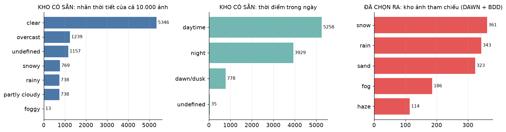
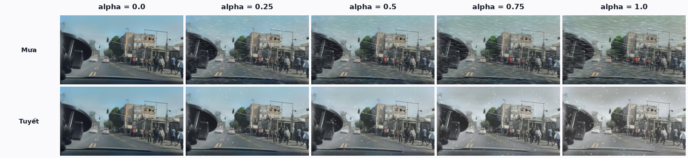
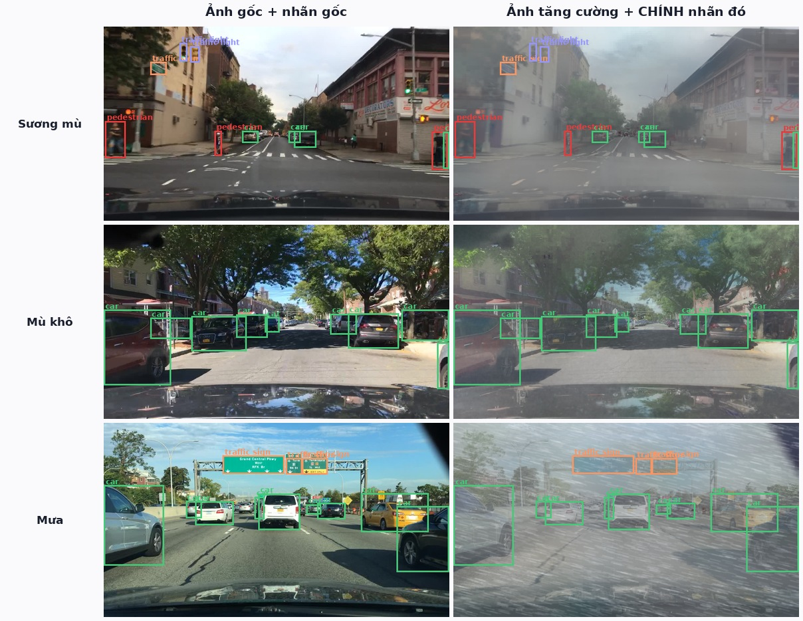
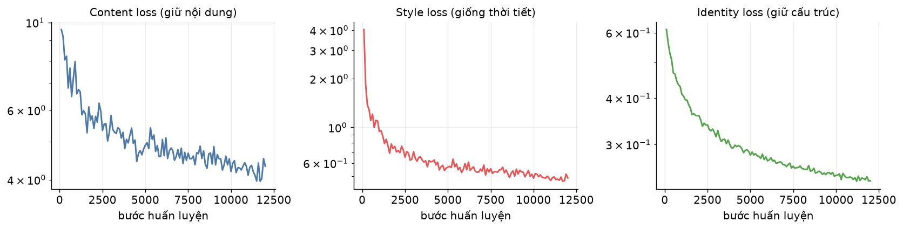
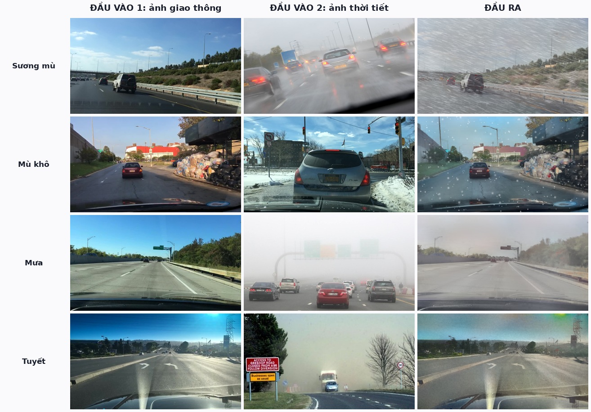
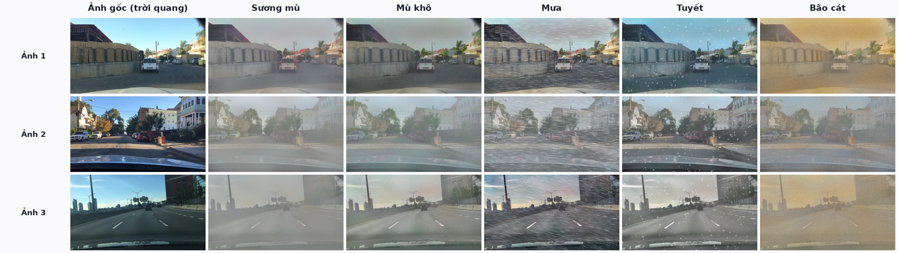
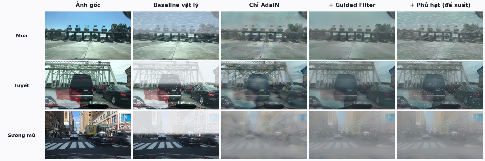

# Tăng cường dữ liệu ảnh giao thông bằng chuyển phong cách thời tiết

*Weather Style Transfer for Traffic Data Augmentation*

**Bài tập cuối khoá — môn Deep Learning Ứng dụng**

| | |
|---|---|
| **Nhóm** | 6 |
| **Thành viên** | Hoàng Minh Đức · Trần Quý Đạt · Hoàng Trung Kiên · Vũ Thuỳ Linh |
| **Mã nguồn** | https://github.com/QuyDatSadBoy/StyleTranfer_Viettel_Course_DeepLearning |

---

**Bài toán.** Cho một ảnh giao thông chụp trong **điều kiện bình thường** và một ảnh
**tham chiếu thời tiết** (mưa, tuyết, sương mù, bão cát), sinh ra ảnh giao thông đó dưới
điều kiện thời tiết mong muốn, nhằm **tăng cường dữ liệu huấn luyện** cho các mô hình thị
giác máy tính trên đường phố.

---

## 1. Tóm tắt

Báo cáo trình bày một pipeline hoàn chỉnh gồm ba khối nối tiếp — **AdaIN** (chuyển phong cách
bằng học sâu), **Guided Filter** (hậu xử lý giữ biên) và **module hiệu ứng vật lý** (phủ hạt
mưa/tuyết) — cho phép biến một ảnh giao thông trời quang thành ảnh cùng cảnh dưới bốn điều
kiện thời tiết xấu.

Điểm mấu chốt của giải pháp: **cả ba khối chỉ thay đổi giá trị màu tại từng điểm ảnh, không
làm dịch chuyển vật thể**, nên toàn bộ nhãn bounding box của ảnh gốc được tái sử dụng nguyên
vẹn. Chi phí gán nhãn cho dữ liệu mới sinh ra bằng **0**.

Mô hình chỉ có **3,51 triệu tham số cần huấn luyện** (decoder), huấn luyện xong trong
**37 phút** trên một GPU tiêu dùng (RTX 5060 Ti), và suy luận ở tốc độ vài chục mili-giây
mỗi ảnh.

## 2. Đặt vấn đề

Các mô hình phát hiện vật thể trên đường phố suy giảm rõ rệt khi gặp thời tiết xấu, chủ yếu vì
tập huấn luyện lệch nặng về ảnh trời quang ban ngày. Ngay trong BDD100K — một trong những bộ
dữ liệu lái xe lớn và đa dạng nhất — ảnh mưa/tuyết ban ngày chỉ chiếm khoảng 8%.

Thu thập thêm ảnh thời tiết xấu tốn kém trên hai phương diện: phải **chờ đúng thời tiết** để ra
hiện trường quay chụp, và sau đó phải **gán nhãn lại từ đầu**. Sinh ảnh tổng hợp từ dữ liệu đã
có nhãn giải quyết cả hai vấn đề cùng lúc.

### Yêu cầu đặt ra

| # | Yêu cầu | Đáp ứng |
|---|---------|---------|
| 1 | Đầu vào là **2 ảnh**: ảnh giao thông + ảnh thời tiết | AdaIN nhận đúng hai ảnh làm đầu vào |
| 2 | Ưu tiên **mã nguồn mở** | AdaIN, Guided Filter, VGG-19, BDD100K, DAWN, YOLOv8 |
| 3 | Có **data / train / inference** đầy đủ | `scripts/`, `train.py`, `infer.py` |
| 4 | Có **web trực quan** | `app/app.py` (Gradio, 4 tab) |
| 5 | **Dễ giải thích** | Toàn bộ phương pháp gói trong một công thức 1 dòng |

## 3. Khảo sát và lựa chọn phương pháp

| Tiêu chí | **AdaIN** *(chọn)* | CycleGAN | Diffusion (ControlNet/IP-Adapter) |
|---|---|---|---|
| Nhận ảnh tham chiếu làm đầu vào | ✅ đúng đề bài | ❌ học một miền cố định | ⚠️ cần thêm IP-Adapter |
| Thời gian huấn luyện | 37 phút | 1–2 ngày | nhiều ngày |
| Tốc độ suy luận | ~30 ms | ~30 ms | 2–10 giây |
| Giữ cấu trúc (nhãn còn dùng được) | ✅ (kết hợp guided filter) | ⚠️ hay biến dạng vật thể | ⚠️ khó kiểm soát |
| Thêm loại thời tiết mới | ✅ chỉ cần ảnh tham chiếu | ❌ huấn luyện lại | ✅ |
| Độ phức tạp giải thích | Thấp — một công thức | Trung bình | Cao |

AdaIN được chọn vì là phương pháp **duy nhất** trong ba lựa chọn vừa nhận đúng hai ảnh đầu vào
như đề bài yêu cầu, vừa nhẹ, nhanh và dễ giải thích. Hai điểm yếu cố hữu của nó — làm mờ biên
và không tạo được hạt mưa cục bộ — được bù bằng hai khối hậu xử lý không cần huấn luyện.

## 4. Dữ liệu



Biểu đồ trên mô tả **kho 10.000 ảnh có sẵn** trong metadata của BDD100K (tổng ba cột đầu đúng
bằng 10.000). Từ kho đó nhóm **lọc ra** phần thực sự dùng — chỉ lấy ảnh ban ngày và giới hạn số
lượng cho nhẹ:

| Đã chọn ra từ kho | Vai trò trong hệ thống | Số lượng | Giấy phép |
|---|---|---|---|
| **BDD100K** — trời quang / nhiều mây, **ban ngày** | Ảnh nội dung (đầu vào) + nhãn bounding box | 2160 train + 240 val = 2400 ảnh | BSD-3-Clause |
| **BDD100K** — mưa / tuyết, **ban ngày** | 300 ảnh tham chiếu + 500 ảnh tập test **thật** | 800 ảnh | BSD-3-Clause |
| **DAWN** (Mendeley, DOI 10.17632/766ygrbt8y.3) | Ảnh tham chiếu: sương mù / mù khô / mưa / tuyết / bão cát | 1.027 ảnh | **Chỉ nghiên cứu** |

**Kho ảnh tham chiếu đã dựng:** fog = 186, haze = 114, rain = 343, sand = 323, snow = 361 — tổng **1327** ảnh.

BDD100K được chọn vì mỗi ảnh có sẵn ba loại nhãn cần thiết cùng lúc: nhãn **thời tiết**
(để lọc ra ảnh trời quang làm đầu vào và ảnh thời tiết xấu làm tập test), nhãn **thời điểm
trong ngày** (để loại ảnh ban đêm), và **bounding box** 10 lớp (để chạy thí nghiệm kiểm chứng
ở mục 8).

**Chống rò rỉ dữ liệu.** Tập ảnh mưa/tuyết thật được chia đôi: 300 ảnh đầu vào kho ảnh tham
chiếu, 500 ảnh còn lại **chỉ** dùng làm tập test và không xuất hiện ở bất kỳ khâu nào khác.

## 5. Phương pháp đề xuất

```
   ẢNH GIAO THÔNG (trời quang)          ẢNH THAM CHIẾU (mưa/tuyết/sương)
              │                                      │
              └──────────► VGG-19 (đóng băng) ◄───────┘
                                 │
                      ┌──────────▼──────────┐
                      │ ① AdaIN             │   σ(s)·(c−μ(c))/σ(c) + μ(s)
                      └──────────┬──────────┘
                            Decoder (học)
                      ┌──────────▼──────────┐
                      │ ② Guided Filter     │   q = a·I + b (I = ảnh gốc)
                      └──────────┬──────────┘
                      ┌──────────▼──────────┐
                      │ ③ Phủ hạt (vật lý)  │   vệt mưa / bông tuyết / bụi cát
                      └──────────┬──────────┘
                                 ▼
                 ẢNH THỜI TIẾT XẤU + NHÃN CŨ DÙNG LẠI 100%
```

### 5.1. Khối ① — AdaIN

Ảnh nội dung `c` và ảnh tham chiếu `s` cùng được đưa qua VGG-19 đã huấn luyện trên ImageNet
(**đóng băng, không học lại**) để lấy đặc trưng tại tầng `relu4_1`. Phép biến đổi cốt lõi:

> **AdaIN(c, s) = σ(s) · ( c − μ(c) ) / σ(c) + μ(s)**

trong đó `μ`, `σ` là trung bình và độ lệch chuẩn tính **theo từng kênh, từng ảnh**.

Diễn giải: phép chia `(c − μ(c)) / σ(c)` xoá phong cách gốc (tông trời quang) nhưng giữ nguyên
**cấu trúc không gian** — vị trí xe, làn đường, biển báo nằm ở đâu vẫn ở đó. Phép nhân `σ(s)`
và cộng `μ(s)` sau đó "nhuộm" đặc trưng bằng thống kê của ảnh thời tiết. Vì chỉ thống kê
**theo kênh** bị thay đổi, bản đồ đặc trưng không hề bị dịch chuyển.

Decoder — phần **duy nhất** được huấn luyện — dựng ngược đặc trưng đã nhuộm thành ảnh RGB.

Tham số `alpha` cho phép nội suy: `t = alpha · AdaIN(c,s) + (1−alpha) · c`, nhờ đó **một cặp
ảnh sinh ra được nhiều mức thời tiết nặng/nhẹ khác nhau** — rất hữu ích để đa dạng hoá dữ liệu.



### 5.2. Khối ② — Guided Filter

AdaIN chuyển tông màu tốt nhưng làm nhoè biên, ảnh trông như tranh vẽ nên không dùng để huấn
luyện detector được. Guided Filter (He et al., ECCV 2010) coi ảnh AdaIN là tín hiệu cần lọc `p`
và ảnh gốc là **ảnh dẫn hướng** `I`, rồi tìm quan hệ tuyến tính cục bộ trong từng cửa sổ nhỏ:

> **q = a · I + b**, với `a = cov(I,p) / (var(I) + ε)` và `b = μ(p) − a · μ(I)`

Kết quả mang **màu và độ sáng của ảnh AdaIN** nhưng **biên và chi tiết của ảnh gốc**. Đây chính
là kỹ thuật hậu xử lý mà các phương pháp photorealistic style transfer (PhotoWCT, WCT²) sử dụng.

**Bán kính cửa sổ quyết định chất lượng.** Đây là chi tiết cài đặt quan trọng nhất của cả
pipeline, ban đầu chúng tôi đặt sai và ảnh ra bị mờ:

| Bán kính | `a`, `b` biến đổi | Kết quả |
|---|---|---|
| nhỏ (r = 8) | nhanh, bám nhiễu cục bộ | q gần bằng ảnh AdaIN đã làm mượt → **ảnh mờ** |
| lớn (r = 32) | chậm, mượt theo không gian | q = ảnh gốc × trường tương phản/màu mượt → **ảnh sắc nét** |

Với bán kính lớn, `a` và `b` gần như là một "lớp phủ tông màu" thay đổi từ từ trên toàn ảnh.
Nói cách khác, đầu ra chính là **ảnh chụp gốc, giữ nguyên 100% chi tiết**, chỉ bị nhân với một
trường độ tương phản và cộng một trường lệch màu do AdaIN quyết định. Đúng bằng thứ ta cần cho
tăng cường dữ liệu: đổi điều kiện thời tiết mà không đụng đến nội dung.

Cấu hình dùng trong báo cáo: `radius = 32`, `eps = 2·10⁻⁵`.

### 5.3. Khối ③ — Hiệu ứng vật lý

AdaIN khớp thống kê theo kênh nên về bản chất **không thể** tạo ra vệt mưa hay bông tuyết —
đó là các chi tiết cục bộ, không phải thống kê toàn cục. Khối thứ ba bù đúng điểm này:

- **Sương mù / bão cát** — mô hình tán xạ khí quyển: `I' = I·t + A·(1−t)` với `t = exp(−β·d)`.
  Độ sâu `d` được xấp xỉ theo giả thiết mặt đường phẳng: điểm càng gần đường chân trời càng xa.
- **Mưa** — nhiễu thưa được làm mờ chuyển động theo một góc nghiêng để thành vệt, phủ theo chế
  độ *screen*, kèm giảm tương phản và ám xanh lạnh.
- **Tuyết** — bông tuyết ở ba lớp độ sâu (xa: nhỏ và mờ; gần: to và rõ), kèm tăng sáng và giảm
  bão hoà màu.

Module này đồng thời đóng vai trò **baseline không cần học** để so sánh trong phần đánh giá.

### 5.4. Vì sao nhãn bounding box vẫn dùng lại được?

Cả ba khối đều là phép biến đổi **tại chỗ trên từng điểm ảnh**: không dịch chuyển, không co
giãn, không xoay. Toạ độ mỗi vật thể trong ảnh đầu ra trùng khít toạ độ trong ảnh gốc, nên mỗi
ảnh sinh ra chỉ cần **sao chép file nhãn** của ảnh gốc.



*Cùng một bộ bounding box được vẽ lên ảnh gốc (trái) và ảnh tăng cường (phải) — các khung vẫn
ôm khít vật thể.*

## 6. Cài đặt và huấn luyện

| Thành phần | Giá trị |
|---|---|
| Encoder | VGG-19 (ImageNet), **đóng băng** — 0 tham số học |
| Decoder | 3,51 M tham số (phản chiếu VGG tới `relu4_1`, dùng ReflectionPad + Upsample nearest) |
| Dữ liệu | 2160 ảnh nội dung × 1327 ảnh tham chiếu, ghép cặp **ngẫu nhiên** mỗi bước |
| Tiền xử lý | resize cạnh ngắn → 320, cắt ngẫu nhiên 256×256, lật ngang |
| Batch / số bước | 8 / 12,000 |
| Optimizer | Adam, lr 1e-4, `lr_t = lr / (1 + 5e-5·t)` |
| Mixed precision | bfloat16 (thống kê mean/std vẫn tính ở float32 để tránh sai số) |
| Phần cứng | 1 × NVIDIA RTX 5060 Ti 16GB |
| Thời gian huấn luyện | 37 phút |

### Hàm mất mát

> **L = L_content + 10 · L_style + 1 · L_identity**

- **L_content** — sai số bình phương giữa đặc trưng của ảnh đầu ra và đặc trưng AdaIN mục tiêu.
  Giữ bố cục cảnh.
- **L_style** — khớp `μ` và `σ` ở bốn tầng `relu1_1 … relu4_1`. Đưa tông màu về giống ảnh
  tham chiếu.
- **L_identity** — khi ảnh tham chiếu **trùng** ảnh nội dung thì đầu ra phải bằng chính ảnh
  gốc. Đây là **điểm bổ sung so với AdaIN nguyên bản**: nó ép decoder tái tạo trung thực,
  giảm hẳn hiện tượng méo cấu trúc — điều kiện sống còn để nhãn còn dùng được.



Ghép cặp ngẫu nhiên (mỗi ảnh nội dung gặp một ảnh tham chiếu khác nhau ở mỗi lần lặp) buộc
decoder học cách tái tạo cho **mọi** phong cách thay vì ghi nhớ một vài cặp cụ thể. Nhờ đó mô
hình xử lý được cả ảnh thời tiết chưa từng thấy mà không cần huấn luyện lại.

## 7. Kết quả

### 7.1. Định tính



Cùng một ảnh gốc, chỉ cần đổi ảnh tham chiếu là đổi được loại thời tiết:



### 7.2. Đóng góp của từng khối (ablation)



Từ trái sang phải: ảnh gốc → baseline vật lý → chỉ AdaIN → thêm Guided Filter → thêm phủ hạt.
Có thể thấy rõ Guided Filter khôi phục lại độ sắc nét mà AdaIN làm mất, còn khối phủ hạt bổ
sung các chi tiết cục bộ mà AdaIN về bản chất không tạo ra được.

### 7.3. Định lượng

Đánh giá trên **150** ảnh nội dung, so với **150** ảnh mưa/tuyết
**thật** của BDD100K. Vì tập ảnh thật này chỉ gồm **mưa và tuyết**, phần đo FID cũng chỉ sinh
mưa/tuyết (rain, snow) để so cho khớp loại thời
tiết — nếu sinh cả sương mù và bão cát rồi đem so với ảnh mưa/tuyết thì FID bị thổi phồng do
lệch loại, không phản ánh chất lượng sinh ảnh.

| Phương pháp | SSIM ↑ | PSNR ↑ | EdgeRecall ↑ | FID ↓ |
|---|---|---|---|---|
| Không tăng cường *(mốc tham chiếu)* | — | — | — | 99.40 |
| Baseline vật lý (không học) | 0.6076 | 13.32 | 0.5092 | 177.03 |
| Chỉ AdaIN | 0.4521 | 14.13 | **0.6073** | **125.85** |
| AdaIN + Guided Filter + hạt (đề xuất) | **0.6100** | **14.61** | 0.4997 | 164.38 |

**Cách đọc bảng.**

- **SSIM / PSNR / EdgeRecall** đo mức **giữ nội dung** so với ảnh gốc. EdgeRecall là tỉ lệ
  biên Canny của ảnh gốc còn tìm thấy trong ảnh sinh ra — biên chính là hình dáng vật thể mà
  bounding box bao quanh, nên chỉ số này trả lời trực tiếp câu hỏi "nhãn cũ còn khớp không".
  Dùng *recall* thay vì *IoU* vì việc ảnh sinh ra có thêm biên mới (vệt mưa, bông tuyết) là
  điều mong muốn chứ không phải lỗi. Càng cao càng tốt.
- **FID** đo khoảng cách giữa phân bố ảnh sinh ra và phân bố ảnh thời tiết xấu **thật**.
  Càng thấp nghĩa là trông càng giống thật.
- Dòng đầu (**không tăng cường**) là mốc tham chiếu: khoảng cách miền dữ liệu ban đầu giữa ảnh
  trời quang và ảnh thời tiết xấu thật.


Lưu ý khi diễn giải: SSIM cao **không** đồng nghĩa "tốt hơn" một cách tuyệt đối — một ảnh không
thay đổi gì sẽ có SSIM = 1 nhưng vô dụng. Hai nhóm chỉ số phải đọc **cùng nhau**: mục tiêu là
FID thấp (giống thật) *trong khi* EdgeRecall vẫn cao (nhãn còn dùng được).

**Đọc kết quả một cách trung thực.** Không có phương pháp nào thắng tuyệt đối, và điều đó
hợp lý:

- Phương pháp **đề xuất** giữ nội dung tốt nhất (**SSIM** và **PSNR** cao nhất) — nhờ Guided
  Filter bán kính lớn giữ nguyên chi tiết ảnh chụp gốc.
- **Chỉ AdaIN** lại thắng ở **FID** và **EdgeRecall**. Lý do nằm ở khối phủ hạt: vệt mưa và
  bông tuyết làm ảnh trông "ra thời tiết" với mắt người, nhưng (a) chúng là dấu vết tổng hợp
  mà mạng Inception phát hiện và phạt nặng, và (b) chúng che bớt biên nên Canny tìm được ít
  biên gốc hơn. Đáng chú ý là ảnh mưa thật trong BDD100K phần lớn được chụp qua kính chắn gió
  nên gần như **không thấy vệt mưa rời** — chủ yếu là mặt đường ướt và độ tương phản thấp.
  Đây là một phát hiện có ích: với dữ liệu dashcam, nên **giảm mật độ hạt** (hoặc tắt hẳn) và
  để AdaIN lo phần tông màu.

Cũng cần thẳng thắn về giới hạn của FID trong bài toán này. FID dựa trên đặc trưng Inception,
vốn **rất nhạy với mọi dấu vết tổng hợp** (độ mờ nhẹ, nhiễu tái tạo của decoder). Ảnh gốc chưa
tăng cường tuy khác hẳn về thời tiết nhưng lại là **ảnh chụp thật 100%**, cùng camera, cùng độ
phân giải, cùng bố cục dashcam với tập ảnh thật — nên nó có lợi thế tự nhiên về FID. Vì vậy
FID ở đây nên đọc là *"ảnh sinh ra chân thực đến mức nào"* (so sánh giữa ba phương pháp với
nhau) chứ **không** phải bằng chứng về việc thu hẹp khoảng cách miền. Bằng chứng đó nằm ở
**mục 8**: thí nghiệm huấn luyện detector thật rồi đo mAP trên ảnh thời tiết xấu thật.

## 8. Thí nghiệm kiểm chứng: dữ liệu sinh ra có thực sự hữu ích?

Đây là thí nghiệm quan trọng nhất của báo cáo — nó trả lời câu hỏi thực tế thay vì chỉ nhìn
ảnh đẹp hay xấu.

**Thiết kế.** Ba mô hình YOLOv8n giống hệt nhau về kiến trúc, siêu tham số và seed:

- **A. Baseline** — 1000 ảnh trời quang, 20 epoch
- **B. Baseline-long** — cùng bộ ảnh đó nhưng 40 epoch
- **C. Augmented** — 2000 ảnh (trời quang + ảnh sinh ra), 20 epoch
- Tập test chung: **375** ảnh mưa/tuyết thật
- Tập đối chứng: **240** ảnh trời quang
- imgsz 640 · YOLOv8n khởi tạo từ trọng số COCO

Vì sao cần nhánh **B**? Nhánh C có gấp đôi số ảnh, nên với cùng số epoch nó cũng nhận gấp đôi
số bước cập nhật gradient. Nếu chỉ so C với A thì không phân biệt được phần cải thiện đến từ
**dữ liệu mới** hay chỉ từ **huấn luyện lâu hơn**. Nhánh B có đúng số bước cập nhật như C nhưng
**không có dữ liệu mới**, nên phép so sánh công bằng là **C − B**.

Các phép tăng cường màu sẵn có của YOLO (HSV, mosaic, erasing) được **tắt** để cô lập ảnh
hưởng của dữ liệu do mô hình sinh ra.

| Tập kiểm tra | A. Baseline | B. Baseline-long | C. + Tăng cường | C − B |
|---|---|---|---|---|
| Thời tiết xấu **THẬT** · mAP50 | 0.2363 | 0.2451 | 0.2603 | **+0.0153** (+6.2%) |
| Thời tiết xấu **THẬT** · mAP50-95 | 0.1299 | 0.1339 | 0.1411 | **+0.0072** (+5.3%) |
| Trời quang *(đối chứng)* · mAP50 | 0.3028 | 0.3204 | 0.3349 | **+0.0145** (+4.5%) |
| Trời quang *(đối chứng)* · mAP50-95 | 0.1727 | 0.1797 | 0.1877 | **+0.0080** (+4.5%) |

✅ **Dữ liệu tăng cường có ích**: so với nhánh đối chứng có CÙNG số bước cập nhật, mAP50 trên ảnh thời tiết xấu thật tăng **+0.0153** (+6.2%).

Hàng *trời quang* là **đối chứng**: nó xác nhận rằng việc thêm dữ liệu tăng cường không làm mô
hình kém đi trong điều kiện bình thường — một rủi ro thường gặp khi tăng cường quá tay.

Bộ dữ liệu tăng cường đã sinh: **1000** ảnh
(fog=185, haze=196, rain=206, sand=214, snow=199),
mỗi ảnh kèm đúng file nhãn của ảnh gốc.

### 8.1. Công thức tăng cường đã dùng

Mỗi ảnh gốc sinh ra `k` biến thể; với mỗi biến thể, các tham số được **bốc ngẫu nhiên**:

| Tham số | Miền giá trị | Vì sao |
|---|---|---|
| Loại thời tiết | đều nhau trong {fog, haze, rain, snow, sand} | phủ đủ các điều kiện |
| Ảnh tham chiếu | ngẫu nhiên trong kho của loại đó | mỗi ảnh cho một tông màu khác nhau |
| `alpha` | 0,70 – 1,00 | tạo mức thời tiết nặng/nhẹ khác nhau |
| Mật độ hạt | 0,25 – 0,65 | mưa/tuyết dày mỏng khác nhau |
| Góc & độ dài vệt mưa | −22° … +8°, dài theo mật độ | mô phỏng hướng gió |
| `std_floor` | 0,4 (cố định) | bảo đảm vật thể còn nhìn thấy được |

Ngẫu nhiên hoá là điều bắt buộc: nếu mọi ảnh đều cùng một tông, detector sẽ học đúng **một**
kiểu nhiễu chứ không học được tính bất biến với thời tiết nói chung.

## 9. Web demo

`app/app.py` dựng giao diện Gradio gồm bốn tab:

1. **Sinh ảnh thời tiết** — tải lên ảnh giao thông, chọn loại thời tiết, chọn hoặc để hệ thống
   tự lấy ảnh tham chiếu, điều chỉnh `alpha` và mật độ hạt, xem kết quả bằng thanh trượt so
   sánh trước/sau và tải ảnh về.
2. **So sánh phương pháp** — hiển thị cạnh nhau: ảnh gốc, baseline vật lý, chỉ AdaIN, và
   phương pháp đề xuất.
3. **Sinh hàng loạt** — mô phỏng khâu tạo dữ liệu huấn luyện thực tế.
4. **Giới thiệu phương pháp** — giải thích ba khối cho người xem không chuyên.

```bash
python app/app.py      # http://127.0.0.1:7860
```

## 10. Hạn chế và hướng phát triển

**Hạn chế**

1. AdaIN chuyển thống kê **toàn cục**, chưa phân biệt vùng trời với mặt đường — sương mù có độ
   dày như nhau ở gần và ở xa trong phần do AdaIN tạo ra.
2. Không có bản đồ độ sâu thật; module vật lý dùng giả thiết mặt đường phẳng, sẽ kém chính xác
   với ảnh chụp từ trên cao hoặc camera nghiêng.
3. Chất lượng phụ thuộc ảnh tham chiếu: ảnh tham chiếu lệch quá nhiều về góc chụp hoặc bố cục
   sẽ cho tông màu không tự nhiên.
4. DAWN chỉ được phép dùng cho mục đích nghiên cứu.

**Hướng phát triển**

1. Thêm mặt nạ phân vùng trời / đường để chuyển tông riêng cho từng vùng.
2. Dùng mô hình ước lượng độ sâu đơn ảnh (Depth Anything, MiDaS) thay giả thiết mặt đường phẳng.
3. Thay AdaIN bằng AdaAttN hoặc WCT² để bám cấu trúc tốt hơn nữa.
4. Thu thập ảnh tham chiếu thời tiết **tại Việt Nam** để khớp bối cảnh triển khai.
5. Mở rộng sang các điều kiện khó khác: ban đêm, chói nắng ngược, đèn pha ngược chiều.

## 11. Dùng với dữ liệu của bạn

Pipeline **không ràng buộc** vào BDD100K hay DAWN. Để chạy trên dữ liệu riêng, chỉ cần:

1. Đặt ảnh giao thông điều kiện bình thường vào một thư mục.
2. Đặt ảnh thời tiết tham chiếu vào `data/style/<tên_loại>/` (ảnh chụp bằng điện thoại cũng được —
   AdaIN chỉ lấy thống kê màu, không cần ảnh cùng góc chụp).
3. Suy luận trực tiếp, **không cần huấn luyện lại**:

```bash
python infer.py --content thu_muc_anh_cua_ban --style data/style/rain                 --out outputs/ket_qua --particles 0.5
```

Chỉ cần huấn luyện lại decoder khi ảnh của bạn khác hẳn về miền (ví dụ ảnh hồng ngoại,
ảnh vệ tinh) — khi đó chạy lại `train.py` với thư mục ảnh mới.

Nếu có nhãn bounding box ở định dạng YOLO, đặt vào `data/processed/labels/` là
`augment_dataset.py` sẽ tự sao chép nhãn sang ảnh mới.

## 12. Hướng dẫn tái lập

```bash
python -m venv .venv && source .venv/bin/activate
pip install torch torchvision --index-url https://download.pytorch.org/whl/cu128
pip install -r requirements.txt

bash run_all.sh          # chạy toàn bộ: tải dữ liệu → train → đánh giá → thí nghiệm
python app/app.py        # mở web demo
```

Hoặc chạy từng bước — xem `README.md`.

## 13. Giấy phép dữ liệu và mô hình

| Thành phần | Giấy phép | Lưu ý khi thương mại hoá |
|---|---|---|
| BDD100K | BSD-3-Clause | Dùng được |
| **DAWN** | **Chỉ nghiên cứu, cấm thương mại** | **Phải thay thế** |
| VGG-19 (torchvision) | BSD-3-Clause | Dùng được |
| YOLOv8 (Ultralytics) | AGPL-3.0 | Cần mua licence hoặc đổi detector |

Pipeline **không phụ thuộc** vào bộ dữ liệu cụ thể nào — chỉ cần một thư mục ảnh tham chiếu
thời tiết bất kỳ là chạy được. Khi triển khai thương mại, thay DAWN bằng ảnh tự thu thập.

## 14. Tài liệu tham khảo

1. X. Huang, S. Belongie. *Arbitrary Style Transfer in Real-time with Adaptive Instance
   Normalization.* ICCV 2017.
2. K. He, J. Sun, X. Tang. *Guided Image Filtering.* ECCV 2010.
3. F. Yu et al. *BDD100K: A Diverse Driving Dataset for Heterogeneous Multitask Learning.*
   CVPR 2020.
4. M. A. Kenk, M. Hassaballah. *DAWN: Vehicle Detection in Adverse Weather Nature Dataset.* 2020.
5. S. G. Narasimhan, S. K. Nayar. *Vision and the Atmosphere.* IJCV 2002.
6. Y. Li et al. *A Closed-form Solution to Photorealistic Image Stylization.* ECCV 2018 (PhotoWCT).
7. C. Sakaridis, D. Dai, L. Van Gool. *Semantic Foggy Scene Understanding with Synthetic Data.*
   IJCV 2018.
